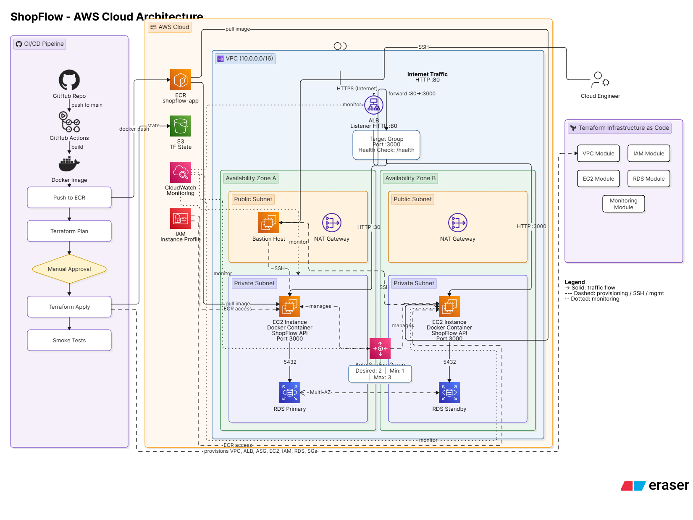
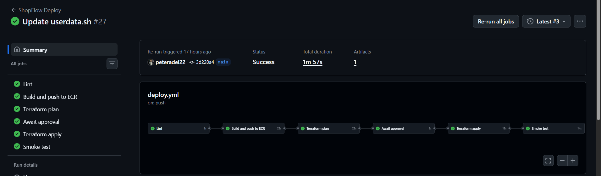

# ShopFlow

A cloud-native application deployed on AWS using Terraform, Docker, Amazon ECR, Auto Scaling, Application Load Balancer, and GitHub Actions CI/CD.

---

## Project Overview

ShopFlow is an end-to-end AWS Cloud Infrastructure project that demonstrates modern DevOps and Cloud Engineering practices.

The application is containerized using Docker, stored in Amazon ECR, deployed automatically on EC2 instances inside an Auto Scaling Group, and exposed through an Application Load Balancer.

Infrastructure provisioning is fully automated using Terraform modules, while GitHub Actions manages the complete CI/CD workflow from code commit to deployment validation.

---

## Architecture Diagram



---

## AWS Architecture

### Networking

* Amazon VPC
* Public Subnets
* Private Subnets
* Internet Gateway
* NAT Gateway
* Security Groups

### Compute

* EC2 Instances
* Auto Scaling Group (ASG)
* Bastion Host

### Containerization

* Docker
* Amazon Elastic Container Registry (ECR)

### Database

* Amazon RDS

### Load Balancing

* Application Load Balancer (ALB)

### Infrastructure as Code

* Terraform

### CI/CD

* GitHub Actions

---

## Architecture Flow

Users

↓

Application Load Balancer (HTTP :80)

↓

Target Group (Port :3000)

↓

Auto Scaling Group

↓

EC2 Instances (Dockerized ShopFlow API)

↓

Amazon RDS

---

## CI/CD Pipeline

The deployment pipeline automatically performs:

1. Lint Dockerfile
2. Build Docker Image
3. Push Image to Amazon ECR
4. Terraform Plan
5. Manual Approval
6. Terraform Apply
7. Smoke Testing

### Pipeline Workflow



---

## Deployment Workflow

Developer

↓

GitHub Repository

↓

GitHub Actions

↓

Build Docker Image

↓

Push to Amazon ECR

↓

Terraform Plan

↓

Manual Approval

↓

Terraform Apply

↓

Auto Scaling Group

↓

EC2 Instances

↓

Application Load Balancer

↓

End Users

---

## Terraform Project Structure

```text
terraform/
├── modules/
│   ├── vpc/
│   ├── iam/
│   ├── ec2/
│   ├── rds/
│   └── monitoring/
├── main.tf
├── variables.tf
├── provider.tf
├── backend.tf
└── outputs.tf
```

---

## Technologies Used

### Cloud Services

* AWS EC2
* AWS VPC
* AWS IAM
* AWS ECR
* AWS RDS
* AWS S3
* AWS Application Load Balancer
* AWS Auto Scaling

### Infrastructure as Code

* Terraform

### Containerization

* Docker

### CI/CD

* GitHub Actions

### Application

* Node.js
* Express.js

---

## Key Features

* Infrastructure as Code using Terraform
* Modular Terraform Design
* Automated CI/CD Pipeline
* Dockerized Application Deployment
* Amazon ECR Integration
* Application Load Balancer
* Auto Scaling Group
* Bastion Host Architecture
* Private Subnet Deployment
* Remote Terraform State Management
* Automated Smoke Testing

---

## Security Implementation

* EC2 instances deployed in private subnets
* Bastion Host used for administrative access
* Security Groups control inbound and outbound traffic
* IAM Instance Profile used for ECR authentication
* Application exposed through ALB only
* Database access restricted to application instances

---

## CI/CD Stages

✔ Lint

✔ Build and Push to ECR

✔ Terraform Plan

✔ Manual Approval

✔ Terraform Apply

✔ Smoke Test

---

## Learning Outcomes

Through this project, I gained hands-on experience with:

* AWS Cloud Architecture
* Infrastructure Automation
* Terraform Modules
* Docker Containerization
* GitHub Actions CI/CD
* Auto Scaling and Load Balancing
* AWS Networking
* IAM and Security Best Practices
* Amazon ECR Integration
* Troubleshooting Production-Like Deployments

---

## Future Enhancements

* HTTPS using AWS Certificate Manager
* Route 53 Domain Integration
* CloudWatch Dashboards and Alerts
* Blue/Green Deployments
* Kubernetes Migration (EKS)
* Infrastructure Testing

